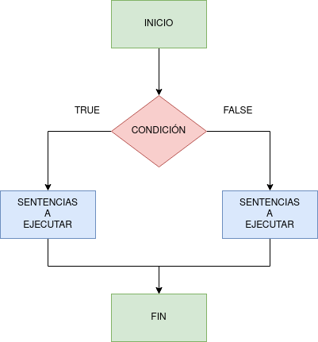
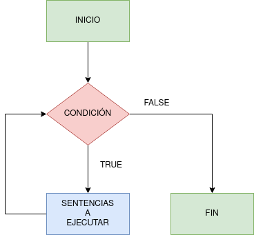
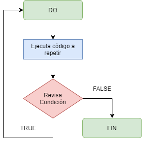
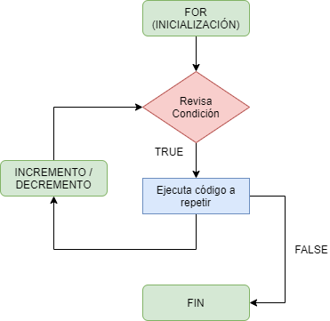

# UF1 RA2 Cas 2 - Estructuras condicionales y bucles
**Autor**: Carlos Masana Martínez
**Grupo**: Individual
**ASIX 1B**

------

1. **Sentencias de control: if - else**

   La estructura **if-else** se utiliza en Java para tomar decisiones sobre un valor preexistente. Es decir, si una condición basada en ese valor preexistente se cumple (true), el programa tomará un camino. Si no (false), el programa tomará otro. Podemos añadir más de una condición a evaluar con **else if.**

   

   

   

   Ejemplo:

   ```java
   import java.util.Scanner;
   
   public class HelloWorld {
   
       public static void main(String[] args) {
           /**
            * Programa que evalúa las estaciones del año
            * según el mes introducido
            */
           
           Scanner consola = new Scanner(System.in); // Declaramos escaner    
           int mes; // Variable que almacena el mes
           String estacion; // Variable que almacena estación
           
           // Mostramos mensaje al usuario
           System.out.println("Introduce un mes (1-12)");
           
           // Asignamos a la variable mes la información introducida por el usuario
           mes = consola.nextInt();
           
           // Condición que evalúa la estación dependiendo del valor del mes introducido
           if (mes == 1 || mes == 2 || mes == 12){
               estacion = "Invierno";
           }
           else if (mes == 3 || mes == 4 || mes == 5) {
               estacion = "Primavera";
           }
           else if (mes == 6 || mes == 7 || mes == 8) {
               estacion = "Verano";
           }
           else if (mes == 9 || mes == 10 || mes == 11) {
               estacion = "Otoño";
           }
           else {
               estacion = "Mes incorrecto";
           }
           
           // Mostramos resultado por pantalla
           System.out.println("El mes " + mes + " se corresponde con la estación de " + estacion);
       }
   }
   ```

   

2. **Bucles**

   Nos permiten repetir o iterar un conjunto de sentencias mientras se cumple una determinada condición.

   1. **Bucle While**

      **Representación en diagrama de flujo:**

      

      **Sintaxis:**

      ```java
      while (condicion) {
      	// Sentencias a repetir
      }
      // Termina bucle
      ```

      

   2. **Bucle Do While**

      **Representación en diagrama de flujo:**

      

      **Sintaxis:**

      ```java
      do {
         // Sentencias a repetir
      }
      while (condicion);
      // Termina el bucle
      ```

      

   3. **Bucle For**

      **Representación en diagrama de flujo:**

      

      **Sintaxis:**

      ```java
      for (inicializacion; condicion; iteracion) {
         // Sentencias a repetir
      }
      // Termina bucle
      ```

      